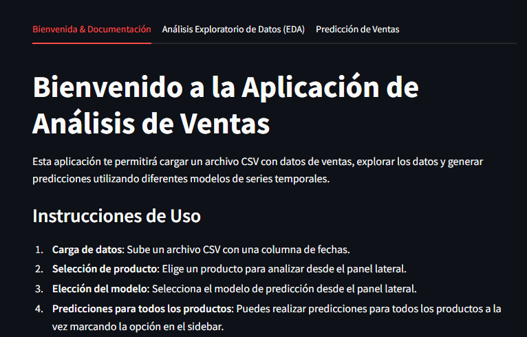
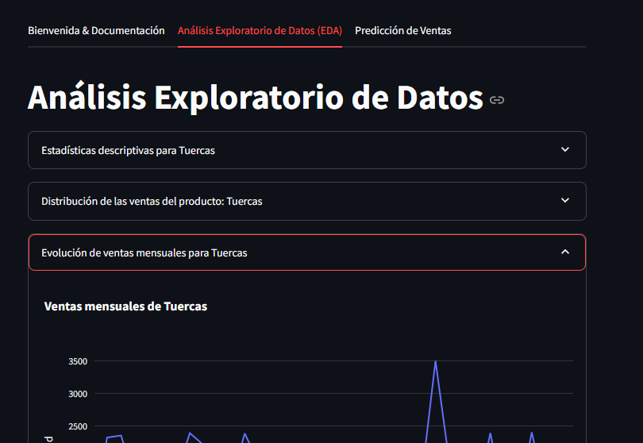
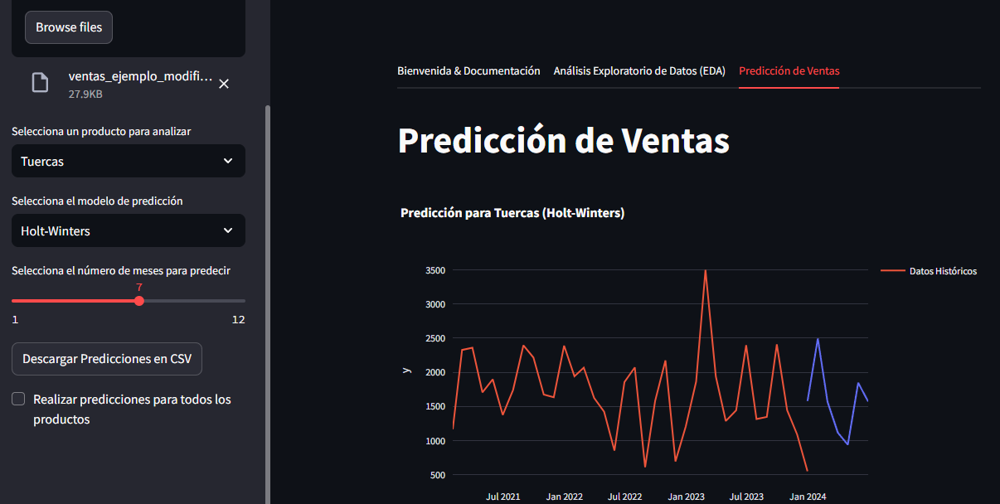

# Aplicación de Análisis de Ventas y Predicción de Ventas con Streamlit

Esta aplicación web interactiva estilo Single Page Aplication (SPA), desarrollada con **Streamlit**, permite cargar datos de ventas, realizar un análisis exploratorio y generar predicciones de ventas utilizando modelos de series temporales y aprendizaje automático.

La idea fue cubrir el trabajo final de la materia Programación II para la Licenciatura en Ciencia de Datos en UCASAL. 


> [!TIP]
> Se puede utilizar a modo de prueba el archivo **"ventas.csv"** disponible en `data/ventas.csv`

## Características

- **Carga de datos**: Sube un archivo CSV con datos de ventas.
- **Análisis Exploratorio de Datos (EDA)**: 
  - Estadísticas descriptivas.
  - Distribuciones de ventas.
  - Evolución de ventas a lo largo del tiempo.
- **Modelos de predicción**:
  - **Regresión Lineal**.
  - **ARIMA** (Modelos AutoRegresivos Integrados de Media Móvil).
  - **Holt-Winters** (Modelos de suavizado exponencial).
- **Visualización**: 
  - Gráficos interactivos con **Plotly** para las predicciones y datos históricos.
- **Comparación de productos**: Comparar predicciones de ventas entre varios productos.
- **Exportación de predicciones**: Descargar las predicciones generadas en formato CSV.

## Capturas de pantalla

### Pantalla de Bienvenida


### Análisis Exploratorio de Datos (EDA)


### Predicción de Ventas


>[!IMPORTANT]
> Vale la pena mencionar que esto fue un proyecto universitario preliminar y los modelos NO tienen la        configuración/pipeline completo, ya que es solo a modo de demostración.


## Requisitos previos

- **Python 3.7+**
- Paquetes de Python listados en `requirements.txt`

### Instalación de dependencias

Primero, clona el repositorio y navega a la carpeta del proyecto. Luego, instala las dependencias requeridas:

```bash
pip install -r requirements.txt
``` 

[Link a la APP!](https://spa-sales-analysis-davidsoler.streamlit.app/)